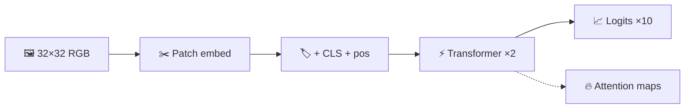

<div align="center">

# 🧠 Mini Vision Transformer  
### *Forward pass only — no training, all visualization*

[](https://www.python.org/)
[](https://pytorch.org/)
[]()

**A tiny ViT in PyTorch** — patch embedding, **CLS** token, **positional** embeddings, **2×** transformer blocks with **`MultiheadAttention`**, and **10** logits — plus pretty figures & shape tables for demos 📊

[⬇️ Clone](#-quick-start) · [▶️ Run demo](#-run-the-demo) · [📁 Outputs](#-generated-outputs) · [📖 Docs](#-documentation-for-submission)

🔗 **Repo:** [**github.com/chenqianwan/Amcc**](https://github.com/chenqianwan/Amcc)  
`git clone git@github.com:chenqianwan/Amcc.git`

</div>

---

## 🎨 What it does (pipeline)



> **No optimizer, no loss loop** — inference only, so you can **see** tensors and **plot** attention without training noise.

---

## 🚀 Quick start

```bash
git clone git@github.com:chenqianwan/Amcc.git
cd Amcc
python3 -m venv .venv
source .venv/bin/activate    # Windows: .venv\Scripts\activate
pip install -r requirements.txt
```

> 💡 **PNGs are not in git** (only `outputs/.gitkeep`). Run `python demo_forward.py` once to paint your `outputs/` folder.

---

## ▶️ Run the demo

| Step | Command |
|:----:|---------|
| 🎯 | `python demo_forward.py` |
| ❔ | `python demo_forward.py -h` |

**What you get:** figures under **`outputs/`** + a **shape table** in the terminal.

### 🧪 Extra scripts

| | Command | Why run it |
|---|---------|------------|
| ✅ | `python validate_project.py` | Shape checks + demo in a temp folder |
| 🔀 | `python compare_inputs.py` | One big figure: 3 synthetic inputs side by side → `outputs/compare/comparison.png` |

### 🎛️ CLI flags (`demo_forward.py`)

`--seed` · `--image-type` (`auto`, `random`, `checkerboard`, `stripes`, `gradient`) · `--save-prefix` · `--output-dir` · `--print-shapes` / `--no-print-shapes`

---

## 🗂️ Repository layout

| Path | Role |
|------|------|
| 📦 `requirements.txt` | torch, torchvision, matplotlib, pillow, numpy |
| 🎬 `demo_forward.py` | Main CLI demo |
| ✅ `validate_project.py` | Lightweight validation (no pytest) |
| 🔀 `compare_inputs.py` | Multi-input comparison figure |
| 🧩 `src/mini_vit/model.py` | `MiniViT`, `PatchEmbed`, blocks |
| 🎯 `src/mini_vit/attention_viz.py` | `AttentionWeights` bundle |
| 🛠️ `src/mini_vit/utils.py` | Synthetic images, plotting |
| 📤 `src/mini_vit/__init__.py` | Exports |
| 🙈 `.gitignore` | `.venv`, caches, generated `outputs/*` |
| 📝 `submission_notes.md` · `presentation_outline.md` · `vibe_coding_log_draft.md` | Submission helpers |

---

## 🖼️ Generated outputs

### After `python demo_forward.py` → `outputs/`

| | File | What it shows |
|---|------|----------------|
| 🌈 | `input_image.png` | 32×32 RGB demo input |
| 📐 | `patch_grid.png` | Same image + 4×4 patch grid |
| 🔮 | `attention_block0_head0.png` | Block 0, **head 0** — CLS→patch heatmap |
| 🌀 | `attention_block0_mean_heads.png` | Block 0, **mean over heads** |
| 🎓 | `attention_cls_to_patches_only.png` | Teaching view: CLS→patches only |
| ⊞ | `attention_block0_patch_grid_heatmap.png` | Mean map + **cell borders** |
| 🖼️‍🔥 | `attention_block0_overlay_on_input.png` | Attention **on top of** the RGB image |
| 📊 | `logits_bar_chart.png` | 10 logits (untrained) |

### After `python compare_inputs.py`

| | File | What it shows |
|---|------|----------------|
| 🧪 | `outputs/compare/comparison.png` | 3 columns: input · attention · logits |

**Tensor story (default):** `64` patch tokens → **`65`** tokens with CLS → attention **`(B, 4, 65, 65)`** → logits **`(B, 10)`**.

---

## ⚠️ Known limitations

| | |
|---|--|
| 🚫 **No training** | Logits are **not** real class predictions. |
| 📏 **32×32 only** | Wrong H×W → clear `ValueError`. |
| 📡 **torchvision** | `auto` tries `FakeData`; broken `_lzma` → procedural fallback. |
| 🧸 **Toy scale** | 64-dim, 2 layers, 4 heads — for **learning**, not SOTA. |

---

## 📚 Documentation for submission

| Doc | Use it for |
|-----|------------|
| 📸 `submission_notes.md` | Screenshots, terminal commands, demo order |
| 🎤 `presentation_outline.md` | ~1–2 min talk structure |
| ✍️ `vibe_coding_log_draft.md` | Reflection on iterative / AI-assisted coding |

---

<div align="center">

**Made for class demos — have fun with tensors!** ✨

</div>
